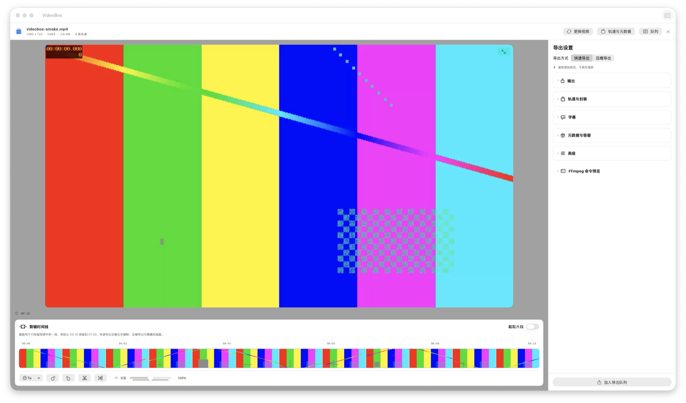

<div align="center">
  
  <h1>VideoBox</h1>
  <p>面向 macOS 的原生视频检查、剪辑、封装转换与压缩工作台。</p>
  <p><a href="README.md">English</a> · <strong>简体中文</strong></p>
</div>



VideoBox 使用 SwiftUI 构建原生界面，以 AVFoundation 提供播放预览，并通过 FFmpeg 完成媒体分析与导出。所有处理均在本机进行；应用同时提供快速码流复制、可配置转码和 FFmpeg 命令预览。

> [!IMPORTANT]
> VideoBox 目前是早期预览版。界面暂为简体中文，使用前需要单独安装 FFmpeg 与 ffprobe；预览版 DMG 仅做临时签名，尚未通过 Apple 公证。

## 主要功能

- 拖放导入、AVPlayer 预览与媒体信息检查。
- 带缩略图的时间线，以及分割、删除、复制、拖放重排和顺序拼接。
- 每个片段可独立设置速度、旋转、水平/垂直镜像、音量与缩放。
- 检查视频、音频、字幕、附件、章节和文件元数据。
- 选择导出轨道，并编辑轨道标题、语言和默认轨道状态。
- 快速码流复制，或转码导出 MP4、MOV、MKV 与 WebM。
- H.264、H.265/HEVC、AV1 与 ProRes，并支持 VideoToolbox 硬件编码。
- 分辨率、帧率、像素格式、码率、目标大小、音频、字幕与容器设置。
- 串行后台导出队列，以及可检查的 FFmpeg 命令预览。

## 运行要求

- macOS 13 Ventura 或更高版本。
- Apple Silicon 或 Intel Mac。
- 通过 Homebrew 或 `PATH` 提供 `ffmpeg` 与 `ffprobe`。

使用 Homebrew 安装媒体工具：

```bash
brew install ffmpeg
```

VideoBox 会检查 `PATH`、`/opt/homebrew/bin`、`/opt/homebrew/opt/ffmpeg-full/bin`、`/usr/local/bin` 和 `/usr/bin`。

## 安装预览版

1. 从 [GitHub Releases](https://github.com/magiconline/VideoBox/releases) 下载最新的通用版 `.dmg`。
2. 打开 DMG，将 **VideoBox** 拖入 **Applications（应用程序）**。
3. 由于预览版尚未公证，如果 macOS 阻止首次启动，请按住 Control 点击应用，再选择“打开”。
4. 导出前请先用上面的命令安装 FFmpeg。

Release 页面会同时提供 `.sha256` 文件，可用于校验下载：

```bash
shasum -a 256 -c VideoBox-0.1.0-macOS-universal.dmg.sha256
```

## 从源码构建

在 Xcode 中打开 `Package.swift`，选择 **VideoBox** scheme 与 **My Mac** 后运行。需要兼容 Swift 5.9 的工具链。

命令行开发：

```bash
swift build
swift test
```

生成通用架构、临时签名的 App 与 DMG：

```bash
./Scripts/create_dmg.sh release
```

产物会写入 `dist/`。如需 Developer ID 签名与公证：

```bash
VIDEOBOX_SIGNING_IDENTITY="Developer ID Application: Your Name (TEAMID)" \
VIDEOBOX_NOTARY_PROFILE="notary-profile" \
./Scripts/create_dmg.sh release
```

公证配置需要事先通过 `xcrun notarytool store-credentials` 保存到钥匙串。

## 项目结构

```text
Assets/                 应用图标源文件
Documentation/          截图与分版本发布说明
Packaging/              macOS App 元数据
Scripts/                可重复执行的 App/DMG 打包脚本
Sources/VideoBox/
├── App/                 App 入口与依赖容器
├── UI/                  SwiftUI 页面与组件
├── Media/               媒体探测结果与模型
├── Player/              AVFoundation 播放能力
├── Editing/             非破坏性剪辑时间线
├── Export/              导出模型与预设
├── Engines/             FFmpeg/ffprobe 进程集成
├── Jobs/                导出任务与队列
└── System/              外部工具探测
Tests/VideoBoxTests/     单元测试与集成测试
```

## 当前状态

VideoBox 目前适合作为本地预览工具使用，还不是完整的消费级正式版本。后续发布工作包括英文界面本地化、内置兼容媒体工具或提供引导式安装、Developer ID 签名与公证，以及覆盖更多真实媒体文件的兼容性测试。

欢迎通过 [GitHub Issues](https://github.com/magiconline/VideoBox/issues) 提交问题，也欢迎范围明确的 Pull Request。
